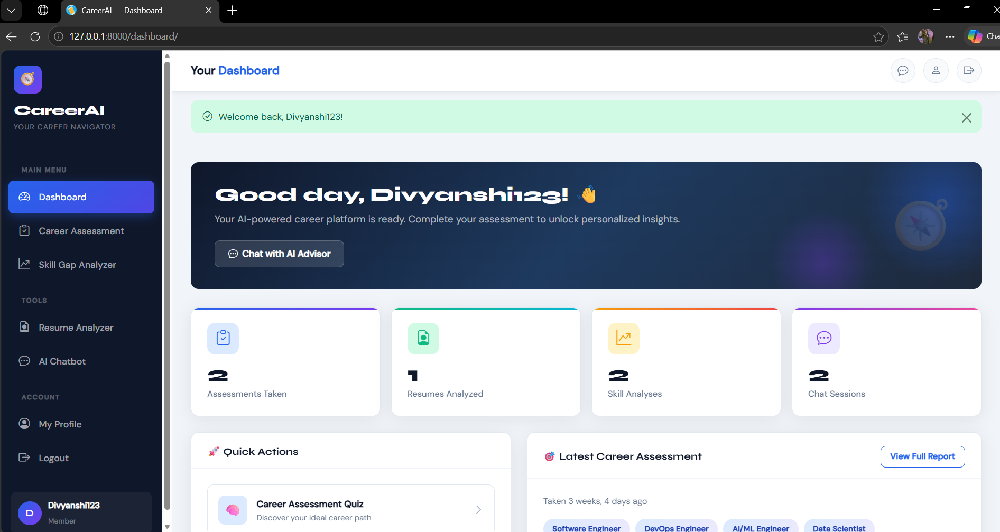
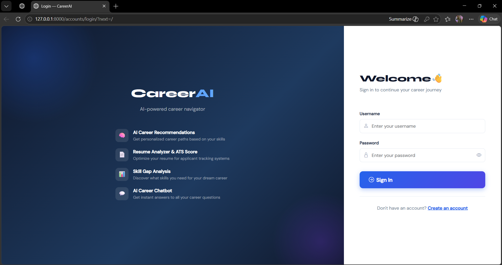
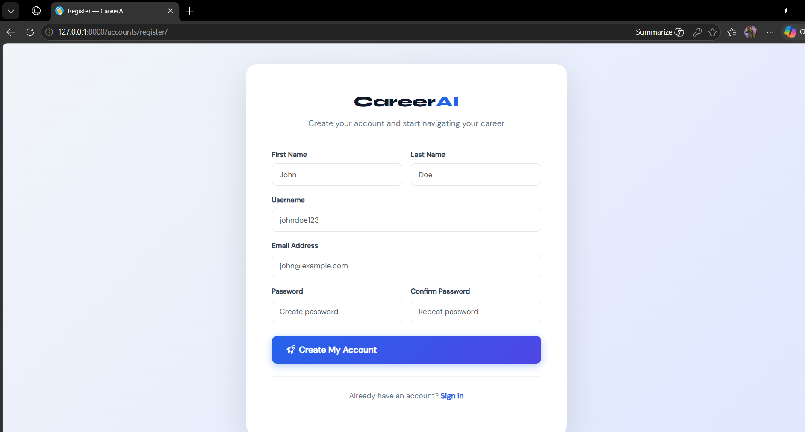
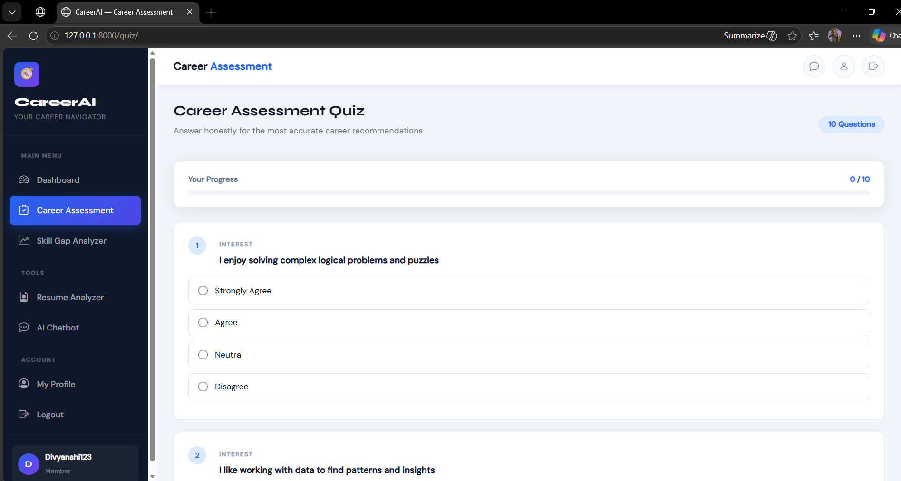
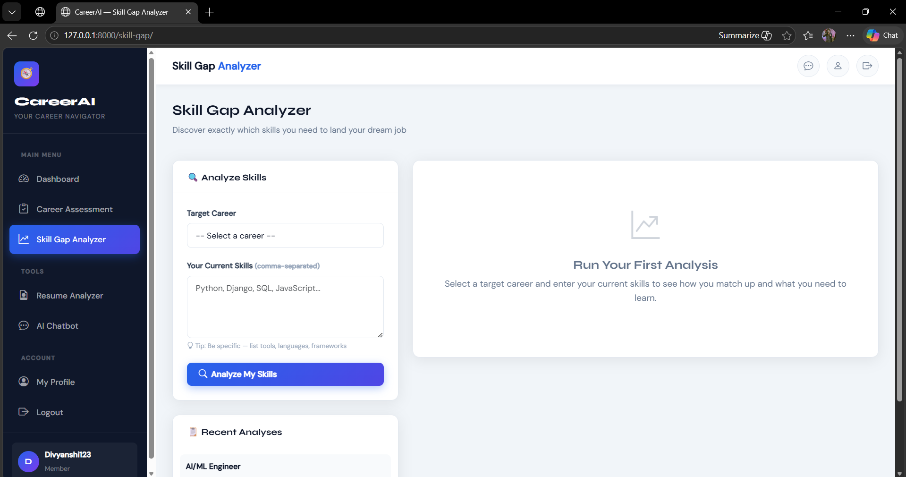
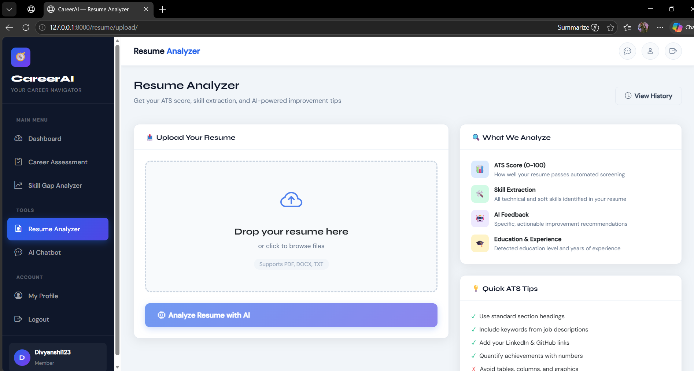
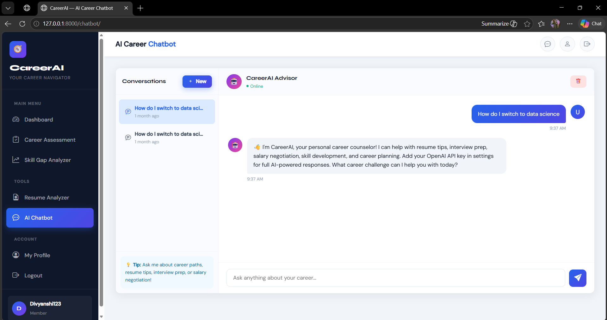

# 🎯 AI-Powered Career Guidance System

> A full-stack web application built with **Django 4.2 and Python 3.1.0** that provides personalized career counseling through AI-powered assessment, resume analysis, skill gap detection, and real-time chatbot guidance — replacing expensive career counseling sessions with a free, intelligent web platform.

---

## 📌 Table of Contents

Features
Tech Stack
System Requirements
Installation
Project Structure
Environment Variables
Database Models
Screenshots
Security
Future Scope
Author
---


## ✅ Features

| Feature | Description |
|---|---|
| 🔐 User Authentication | Secure registration, login, logout with custom profile management |
| 📋 Career Assessment Quiz | 8-question weighted quiz mapping responses to 8 career paths |
| 🤖 AI Career Recommendation | OpenAI GPT-3.5-turbo powered personalized career advice |
| 📄 Resume Analyzer | PDF/DOCX parsing with ATS scoring (0-100) and AI feedback |
| 📊 Skill Gap Analyzer | Compares user skills vs career requirements with course suggestions |
| 💬 AI Career Chatbot | Real-time chatbot with conversation history and smart fallback |
| 🎨 Bootstrap Dashboard | Professional sidebar dashboard with stats and quick actions |
| 🗄️ Django Database | SQLite database managing all user data and assessments |

---

## 🛠️ Tech Stack

### Backend
| Technology | Version | Purpose |
|---|---|---|
| Python | 3.10+ | Core programming language |
| Django | 4.2.0 | Web framework — routing, ORM, auth, admin |
| SQLite | Built-in | Development database |
| OpenAI API | GPT-3.5-turbo | AI career advice and chatbot |

### Frontend
| Technology | Version | Purpose |
|---|---|---|
| Bootstrap | 5.3.2 | Responsive UI components and grid |
| Bootstrap Icons | 1.11.0 | 1800+ free SVG icons |
| Google Fonts (Syne) | Latest | Display font for headings |
| Google Fonts (DM Sans) | Latest | Body font for content |
| JavaScript ES6+ | Browser built-in | AJAX chat, quiz navigation, drag-drop |

### Python Libraries
| Library | Version | Purpose |
|---|---|---|
| python-dotenv | 1.0.0 | Environment variable management |
| openai | 0.28.0 | OpenAI GPT API client |
| PyPDF2 | 3.0.0 | PDF resume text extraction |
| python-docx | 0.8.11 | Word resume text extraction |
| Pillow | 10.0.0 | Profile picture processing |
| django-crispy-forms | 2.0 | Bootstrap-styled form rendering |
| crispy-bootstrap5 | 0.7 | Bootstrap 5 theme for forms |
| whitenoise | 6.5.0 | Static file serving in production |

---

## 💻 System Requirements

### Hardware Requirements

| Component | Minimum | Recommended |
|---|---|---|
| Processor | Intel Core i3 / AMD Ryzen 3 | Intel Core i5 / AMD Ryzen 5 |
| RAM | 4 GB | 8 GB or more |
| Storage | 10 GB free space | 50 GB SSD |
| Network | Broadband Internet | High-speed broadband |
| Display | 1024 x 768 | 1920 x 1080 Full HD |
| OS | Windows 10 / Ubuntu 20.04 / macOS 11 | Windows 11 / Ubuntu 22.04 |

### Software Requirements

| Software | Version | Download |
|---|---|---|
| Python | 3.10 or higher | https://python.org/downloads |
| pip | 23.0+ | Comes with Python |
| Git | Latest | https://git-scm.com |
| VS Code | Latest | https://code.visualstudio.com |
| Web Browser | Chrome 90+ / Firefox 88+ | Any modern browser |

---

## 🚀 Installation & Setup

### Step 1 — Clone the Repository

```bash
git clone https://github.com/yourusername/career-guidance-system.git
cd career-guidance-system
```

### Step 2 — Create Virtual Environment

```bash
# Create virtual environment
python -m venv venv

# Activate on Windows
venv\Scripts\activate

# Activate on Mac/Linux
source venv/bin/activate
```

> ✅ You should see `(venv)` at the start of your terminal line

### Step 3 — Install All Dependencies

```bash
pip install -r requirements.txt
```

### Step 4 — Configure Environment Variables

```bash
# Copy the example env file
cp .env.example .env
```

Open `.env` file and fill in your values:

```env
SECRET_KEY=your-django-secret-key-here
DEBUG=True
OPENAI_API_KEY=your-openai-api-key-here
ALLOWED_HOSTS=localhost,127.0.0.1
```

> 💡 **OpenAI API key is optional** — the system works with intelligent fallback responses without it.
> Get your free key at: https://platform.openai.com/api-keys

### Step 5 — Generate Django Secret Key

```bash
python -c "from django.core.management.utils import get_random_secret_key; print(get_random_secret_key())"
```

Copy the output and paste it as your `SECRET_KEY` in `.env`

### Step 6 — Setup Database

```bash
python manage.py makemigrations accounts
python manage.py makemigrations career
python manage.py makemigrations resume_analyzer
python manage.py makemigrations chatbot
python manage.py migrate
```

### Step 7 — Create Admin User

```bash
python manage.py createsuperuser
```

Enter username, email, and password when prompted.

### Step 8 — Run the Server

```bash
python manage.py runserver
```

Open your browser and visit: **http://127.0.0.1:8000**

Admin panel: **http://127.0.0.1:8000/admin**

---

## 📁 Project Structure

```
career_guidance/
│
├── core/                           → Django project configuration
│   ├── settings.py                 → All project settings
│   ├── urls.py                     → Main URL routing
│   └── wsgi.py                     → WSGI server entry point
│
├── accounts/                       → User authentication & profile
│   ├── models.py                   → Custom User model (AbstractUser)
│   ├── views.py                    → Register, login, logout, profile
│   ├── forms.py                    → RegisterForm, LoginForm, ProfileForm
│   ├── urls.py                     → accounts/ URL patterns
│   └── admin.py                    → Admin panel configuration
│
├── career/                         → Quiz, dashboard, skill gap, AI
│   ├── models.py                   → Question, Option, AssessmentResult
│   ├── views.py                    → Dashboard, quiz, result, skill gap
│   ├── ai_recommender.py           → OpenAI integration & career logic
│   ├── urls.py                     → career/ URL patterns
│   └── admin.py                    → Admin panel configuration
│
├── resume_analyzer/                → Resume upload & analysis
│   ├── models.py                   → Resume model with ATS fields
│   ├── views.py                    → Upload, result, list, delete views
│   ├── parser.py                   → PDF/DOCX parsing & ATS scoring
│   ├── urls.py                     → resume/ URL patterns
│   └── admin.py                    → Admin panel configuration
│
├── chatbot/                        → AI career chatbot
│   ├── models.py                   → ChatSession, ChatMessage models
│   ├── views.py                    → Chat page & AJAX API endpoint
│   ├── urls.py                     → chatbot/ URL patterns
│   └── admin.py                    → Admin panel configuration
│
├── templates/                      → All HTML templates
│   ├── base.html                   → Master layout with sidebar
│   ├── accounts/
│   │   ├── login.html              → Dark themed login page
│   │   ├── register.html           → Registration page
│   │   └── profile.html            → Profile edit page
│   ├── career/
│   │   ├── dashboard.html          → Main dashboard page
│   │   ├── quiz.html               → Interactive quiz page
│   │   ├── quiz_result.html        → AI results page
│   │   ├── skill_gap.html          → Skill gap analyzer page
│   │   └── assessment_history.html → Past assessments list
│   ├── resume_analyzer/
│   │   ├── upload.html             → Drag & drop upload page
│   │   ├── result.html             → ATS score & analysis page
│   │   └── list.html               → All resumes list page
│   └── chatbot/
│       └── chat.html               → Real-time chat interface
│
├── static/
│   └── css/
│       └── custom.css              → Custom styles & animations
│
├── media/                          → User uploaded files (auto-created)
│   ├── profiles/                   → Profile pictures
│   └── resumes/                    → Uploaded resume files
│
├── requirements.txt                → All Python dependencies
├── .env.example                    → Environment variables template
├── .env                            → Your actual secrets (NOT in Git)
├── .gitignore                      → Files to ignore in Git
├── manage.py                       → Django management commands
└── README.md                       → This file
```

---

## 🔑 Environment Variables

| Variable | Required | Default | Description |
|---|---|---|---|
| `SECRET_KEY` | ✅ Yes | None | Django secret key for security & sessions |
| `DEBUG` | ✅ Yes | True | True for dev, False for production |
| `OPENAI_API_KEY` | ⚡ Optional | Empty | OpenAI API key for AI features |
| `ALLOWED_HOSTS` | ✅ Yes | localhost | Comma-separated allowed hostnames |

---

## 🗄️ Database Models

```
accounts_user
├── id, username, email, password
├── first_name, last_name, bio
├── profile_pic, current_skills
├── desired_career, phone
├── linkedin_url, github_url, location
└── created_at, date_joined

career_question              career_option
├── id                       ├── id
├── text                     ├── question_id (FK)
├── category                 ├── text
├── order                    ├── weight (JSON)
└── icon                     └── order

career_assessmentresult
├── id
├── user_id (FK)
├── answers (JSON)
├── scores (JSON)
├── recommended_careers (JSON)
├── ai_advice
└── created_at

resume_analyzer_resume
├── id
├── user_id (FK)
├── file, original_filename
├── extracted_text
├── skills_found (JSON)
├── experience_years
├── education_level
├── ats_score
├── strengths (JSON)
├── improvements (JSON)
├── ai_feedback
└── uploaded_at

chatbot_chatsession          chatbot_chatmessage
├── id                       ├── id
├── user_id (OneToOne FK)    ├── session_id (FK)
├── created_at               ├── role (user/assistant)
└── updated_at               ├── content
                             └── timestamp
```

---

## 🌐 URL Endpoints

| URL | Method | Description |
|---|---|---|
| `/` | GET | Dashboard (redirect if not logged in) |
| `/accounts/register/` | GET, POST | User registration |
| `/accounts/login/` | GET, POST | User login |
| `/accounts/logout/` | GET | User logout |
| `/accounts/profile/` | GET, POST | Profile view and edit |
| `/quiz/` | GET, POST | Career assessment quiz |
| `/quiz/result/<pk>/` | GET | Quiz results with AI advice |
| `/skill-gap/` | GET, POST | Skill gap analyzer |
| `/assessments/` | GET | Assessment history |
| `/resume/upload/` | GET, POST | Resume upload and analysis |
| `/resume/result/<pk>/` | GET | Resume analysis results |
| `/resume/list/` | GET | All uploaded resumes |
| `/resume/delete/<pk>/` | POST | Delete a resume |
| `/chatbot/` | GET | AI chatbot page |
| `/chatbot/api/message/` | POST | AJAX chat API endpoint |
| `/chatbot/api/clear/` | POST | Clear chat history |
| `/admin/` | GET | Django admin panel |

---

## 📸 Screenshots

### 🔐 Login Page


### 📝 Register Page


### 🎨 Career Assessment


### 📋 Dashboard


### 📊 Skill Gap Analyzer


### 📄 Resume Analyzer


### 💬 AI Chatbot


### 🤖 Profile


```

Login Page     → Dark themed with glassmorphism card
Dashboard      → Purple banner, 4 stat cards, tool grid
Quiz Page      → Step-by-step with progress dots
Quiz Result    → Score bars, career cards, AI advice
Skill Gap      → Match percentage, skill badges, courses
Resume Upload  → Drag & drop zone with file preview
Resume Result  → ATS circular meter, skills, AI feedback
Chatbot        → Real-time chat with typing animation
Profile        → Card layout with completion progress bar
```

---

## 🔒 Security Features

- ✅ **CSRF Protection** — All forms include Django CSRF tokens
- ✅ **Password Hashing** — PBKDF2-SHA256 with 260,000 iterations
- ✅ **Login Required** — All tools protected with @login_required
- ✅ **Data Isolation** — Users can only access their own data
- ✅ **File Validation** — Type (PDF/DOCX/TXT) and size (5MB max) checks
- ✅ **SQL Injection Prevention** — Django ORM uses parameterized queries
- ✅ **XSS Prevention** — Django templates auto-escape all variables
- ✅ **Secret Management** — API keys stored in .env file never in code

---

## 🔮 Future Scope

- [ ] Job portal integration (LinkedIn, Naukri, Indeed APIs)
- [ ] Mobile application (Android/iOS using React Native)
- [ ] Video career counseling feature
- [ ] Course enrollment with payment integration
- [ ] AI-powered resume builder with templates
- [ ] Mock interview practice with AI feedback
- [ ] Multi-language support (Hindi and regional languages)
- [ ] PostgreSQL database for production scale
- [ ] REST API with Django REST Framework
- [ ] Email notifications for assessment completion

---

## ⚡ Quick Commands Reference

```bash
# Activate virtual environment (run every time)
venv\Scripts\activate                         # Windows
source venv/bin/activate                      # Mac/Linux

# Install dependencies
pip install -r requirements.txt

# Database commands
python manage.py makemigrations               # Create migration files
python manage.py migrate                      # Apply migrations
python manage.py createsuperuser              # Create admin user

# Run development server
python manage.py runserver                    # http://127.0.0.1:8000

# Collect static files (for production)
python manage.py collectstatic

# Django shell (for testing)
python manage.py shell
```

---

## 🐛 Common Issues & Fixes

| Error | Fix |
|---|---|
| `ModuleNotFoundError: No module named 'django'` | Run `venv\Scripts\activate` then `pip install -r requirements.txt` |
| `No such table: accounts_user` | Run `python manage.py makemigrations` then `python manage.py migrate` |
| `ModuleNotFoundError: No module named 'dotenv'` | Run `pip install python-dotenv` |
| `InconsistentMigrationHistory` | Delete `db.sqlite3` and run migrations again |
| `ImproperlyConfigured: WSGI application could not be loaded` | Run `pip install whitenoise` |
| OpenAI not working | Check `.env` file has correct `OPENAI_API_KEY` |

---

## 👤 Author

Divyanshi GitHub: @Divyanshi8081

---

## 📄 License

This project is developed for **academic purposes** as part of the MCA Final Year Project .

---

## 🙏 Acknowledgements

- [Django Documentation](https://docs.djangoproject.com/en/4.2/) — Web framework
- [OpenAI API Docs](https://platform.openai.com/docs/) — AI integration
- [Bootstrap 5 Docs](https://getbootstrap.com/docs/5.3/) — Frontend framework
- [PyPDF2 Docs](https://pypdf2.readthedocs.io/) — PDF parsing
- [python-docx Docs](https://python-docx.readthedocs.io/) — DOCX parsing

---
